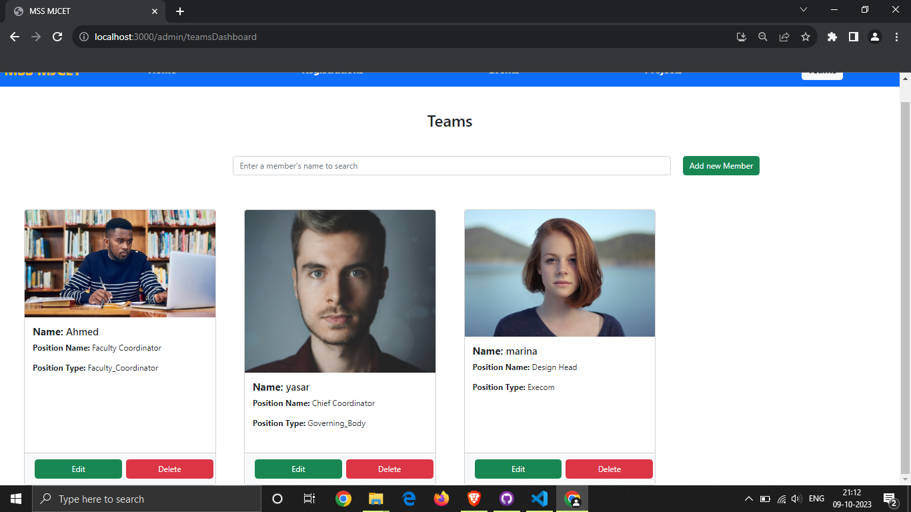
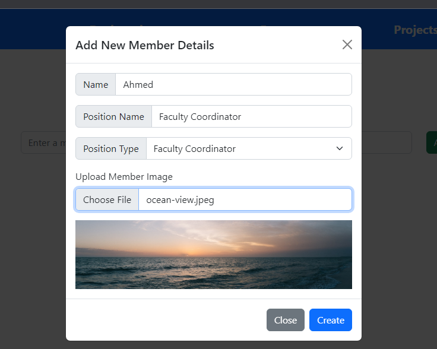
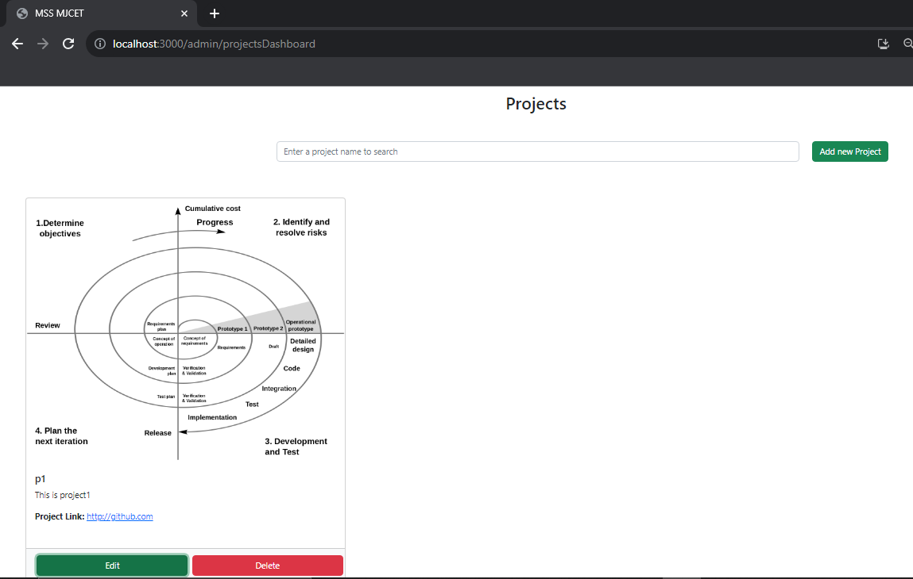
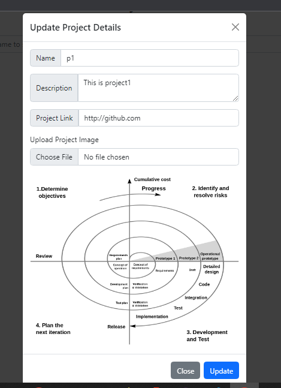
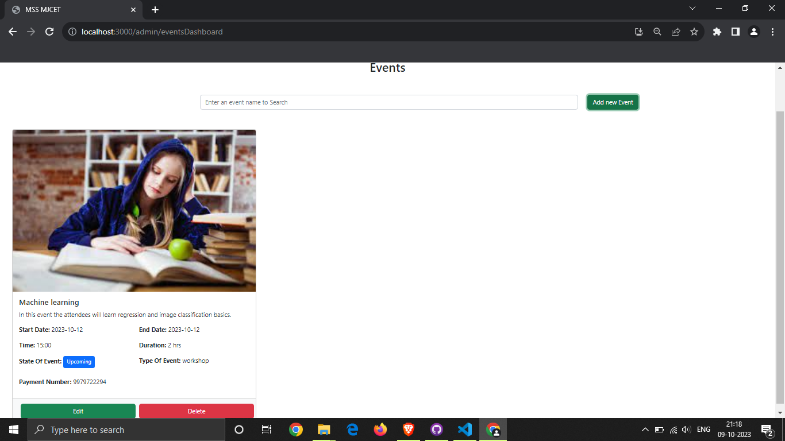
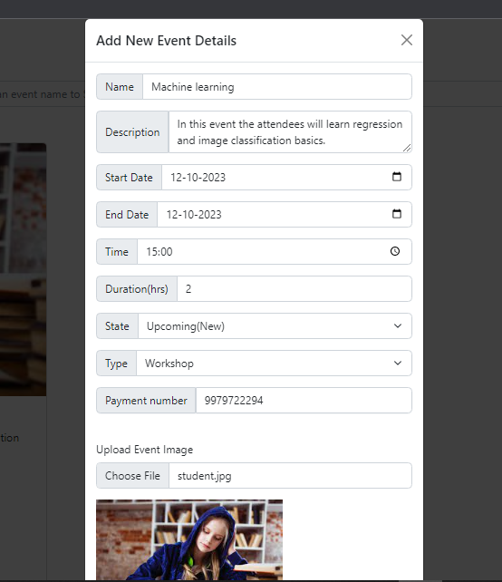
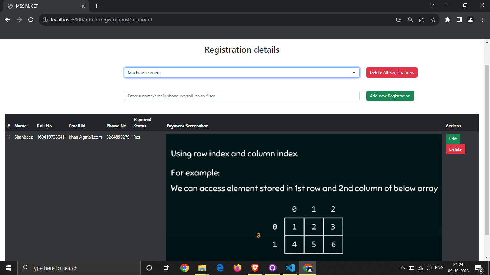
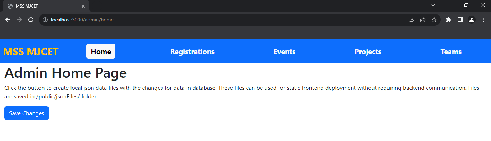

# Admin Operations
Admin operations consist of CRUD operations on events data, projects data, team data and registration data. Also saving the data locally for static access.

## Teams Data
From the admin page  `/admin/teamsDashboard` you can create new members, delete existing ones, update member information and view data of all members.

You can create a new Member by adding the following details for them.

Similarly you can edit details od a member by clicking the edit button.

## Projects Data
From the admin page  `/admin/projectsDashboard` you can perform CRUD operations on projects data.

You can update the projects details as shown below.

## Events Data
From the admin page  `/admin/eventsDashboard` you can perform CRUD operations on events data.

New events can be added by filling the following details.

## Registration Data
From the admin page  `/admin/registrationsDashboard` you can perform CRUD operations on registrations for a event.

To view Registrations ,first select a event from the first dropdown , then if any registrations are available they are loaded from the database.

**NOTE**:- To select a event, first event must be added in the events dashboard page if not created already. 

You can add new registrations from this page as well , and view any registrations done by users.

## Home page
The admin page can be used to save all the changes locally for static access to data without the need for a backend or a database.

This static data can be accessed by the user pages of the frontend, so that the website can be deployed without a backend easily at different hosting sites at low cost.

And whenever a update needs to be done, it can be done locally, then changes can be saved statically , and the updated version of the site can be deployed,thereby saving time.

