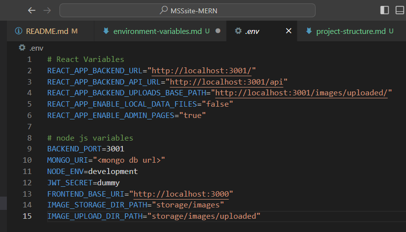
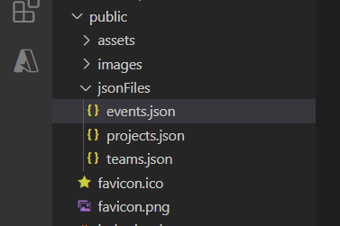
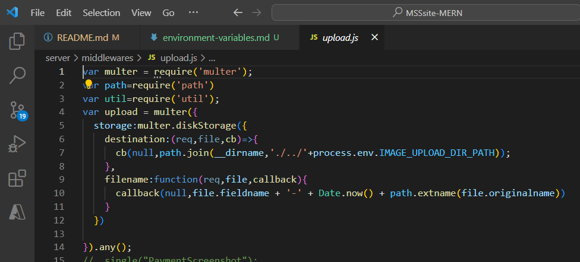

# Environment Variables
The following are the environment variables for React and Nodejs. All env vars for React start with `REACT_APP` prefix.

The use of most variables are self explanatory. A few of them are defined below:

- *REACT_APP_BACKEND_UPLOADS_BASE_PATH* :- used as base path for images to be displayed in frontend by using base path followed by image name. The Base path is defined according to the backend endpoint. 
- *REACT_APP_ENABLE_LOCAL_DATA_FILES*:- If the value is `true` data is fetched from local json files and if it is `false` data is fetched from backend.

- *REACT_APP_ENABLE_ADMIN_PAGES*:-
 If the value is `true` the admin pages can be accessed in the website. If the value is `false` then the admin pages become inaccessible.

**NOTE**:-
Set `REACT_APP_ENABLE_LOCAL_DATA_FILES` and `REACT_APP_BACKEND_UPLOADS_BASE_PATH` to `true` when deploying only the frontend (static site deployment) without the backend.

- *MONGO_URI*:- Set the Connection URI for a local/remote database.

- *IMAGE_STORAGE_DIR_PATH*:- Base directory path for storing different types of images. The path mentioned starts from the server folder as root (configuration in upload.js for multer is specified like this).

- *IMAGE_UPLOAD_DIR_PATH*:- Base path for all images that have been uploaded from the frontend of the site.