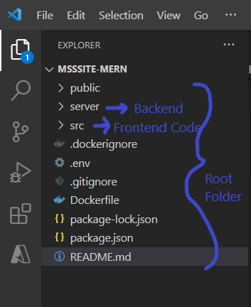
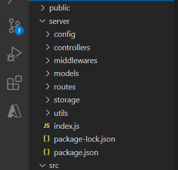
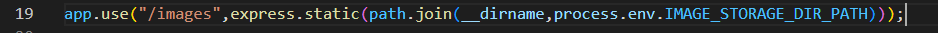
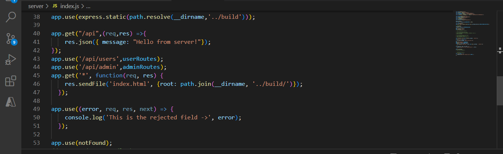
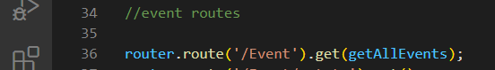
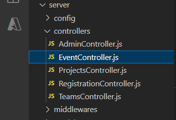
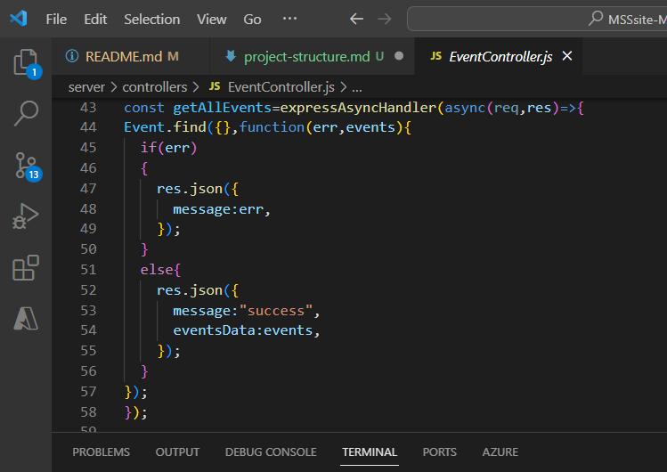
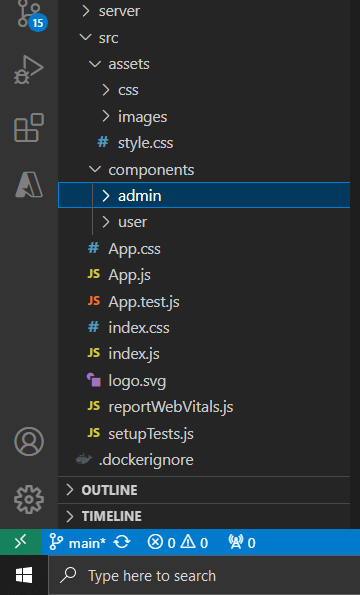
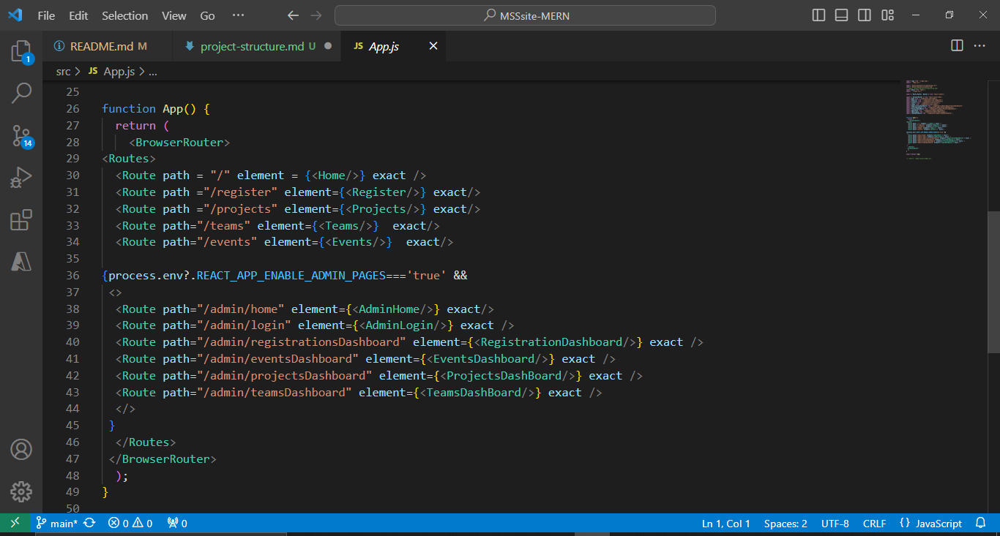
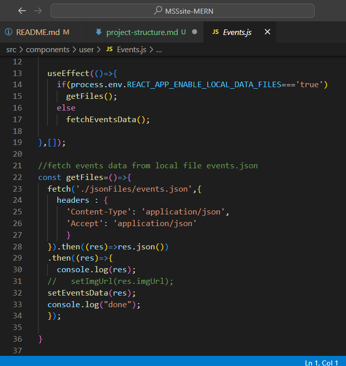

# Project Structure
The project divided into frontend and backend. The technologies used for frontend are 
- React.js 
- Bootstrap

For backend 
- Express.js
- Mongoose

The database used is 
- MongoDB.

 Any images uploaded to the site are stored locally in the system storage. 

**NOTE** -: 
For all data storing and fetching from database actions the backend has to be run. For only retieving data in the frontend for users from local files , running only the frontend is enough.

## Backend Structure
Using the backend you can store events, projects and team members info from the admin portal. Also the frontend the fetch these details 

**NOTE**:-
The backend fetched data only from the database, not local json files.

The backend consists of following folders,

- **models** :- These are data models used by mongoose when interacting with MongoDB to maintain the structure and fields in a collection.
- **routes** :- Files in this folder describe to which urls can frontend send a request which will then be handled by appropriate backend function.
- **controllers** :- This contains the controllers or the backend business logic for processing the frontend reqeuests and interacting with MongoDB using Mongoose.
- **storage** :- This folder contains the uploaded images from the website.
- **config** :-This folder contains the database configuration.
- **middlewares** :- This folder contains the Multer(image processing and storage) configuration.

The entry point(starting point of execution) is index.js file.

## Backend Flow
Any request that comes to backend is routed from `index.js>routes>controllers` and the result is sent back to user

In index.js for user or admin requests, the URI starts with `api/users` and `api/admin` respectively. For images the URI is `/images/<image-name>`. And for any other request `build/index.html` is returned (this contains the frontend code packaged for production).

For requests with `/api/admin` the requests are routed to `adminRoutes.js` file and for `/api/users` requests are routed to `userRoutes.js` file in `routes` folder.

Further the requests are routed to the appropriate function inside the controllers mapped in the router files. For example in the `adminRoutes.js` the `/Event` using `GET Method` request is routed to `getAllEvents` function which is imported from the `controllers\EventController.js`.
And the complete request URI becomes `/api/admin/Event`.

The controller then processes the request and sends back the result.

## Frontend Structure
The `src` folder consists of all the frontend code. The frontend consists of the following folders:
- **assets** :- css and image files
- **components** :- consists of reat function components for admin and user
    - **admin** :- It consists of Events, Projects, Team, Registraion dashboard and Home page where you can save data for static access.
    - **user** :- It consists of Home page, events page, teams page, projects page, and event registration page for users.

There are folders named `unused components` and `unused css`. These folders contain unused files which can be used or referenced if required.

## Frontend flow
The uri in the browser is matched with routes defined in app.js.All the routes for each and every page is defined in `App.js` file. Every route is mapped to a component.

Any REST API request for fetching or storing data is done using fetch API (axios can also be used). Functions for fetching are written in respective files and are called inside useEffect() to load data when the page is rendered.

**NOTE-ONLY FOR USER PAGES**:-
The data can be fetched locally if environment variable is true in `.env` file. The local data is fetched from json files which are saved from admin pages (have to run backend to use admin pages).

