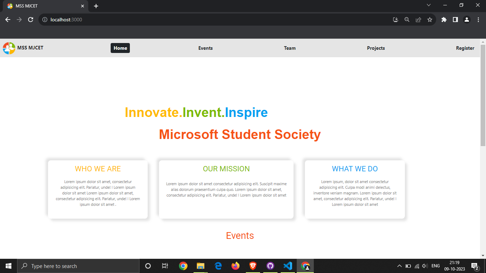
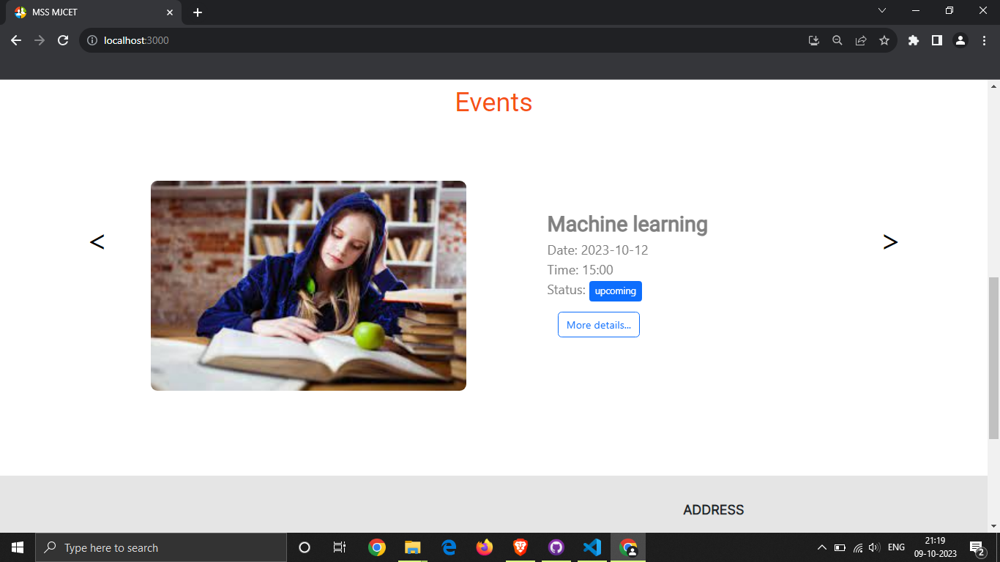
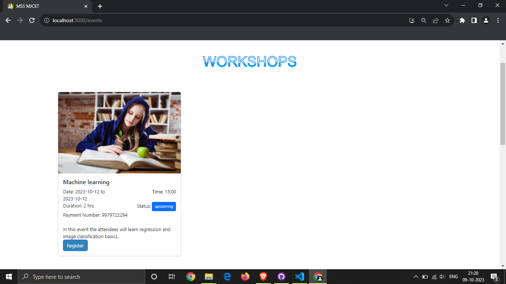
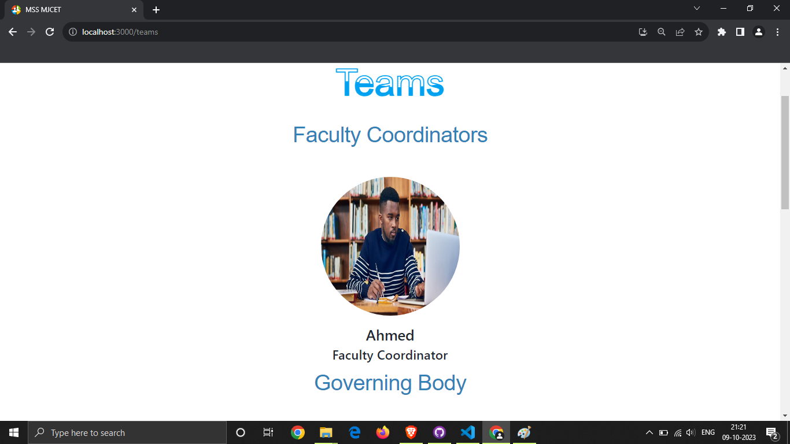
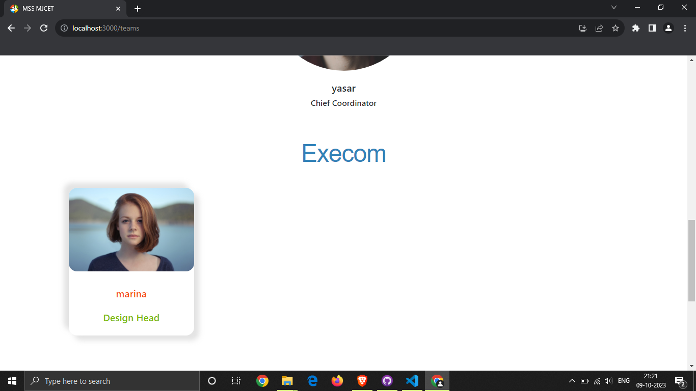
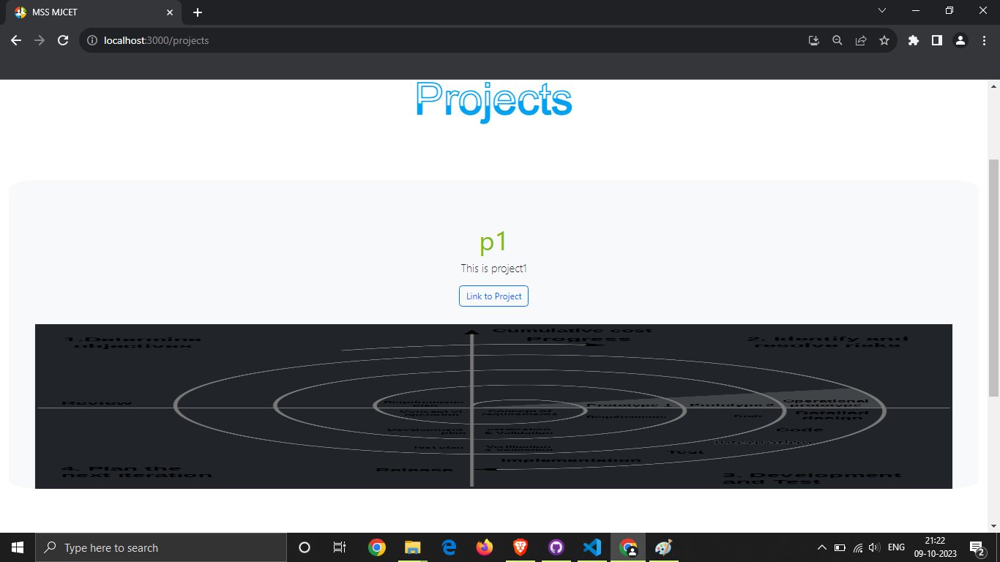
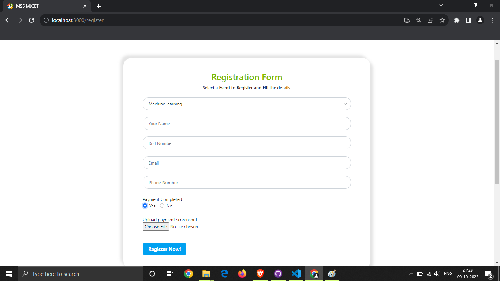

# User Operations
The user operations consist of viewing the events data, projects data, teams data, and register for events.

## Home page
It consists brief description about MSS and displays the current events of MSS.

## Events Page
It consists of All events conducted by MSS including workshops, seminars, webinars and other type of events.

## Teams Page
It consists information about Faculty Coordinators, execom members, and the Governing body. (can be extended for other members as well).

## Projects Page
It consists of all the projects MSS has created and the links to view more info on them(code,pics,website,etc.)

## Registration Page
In this page the user can select any active or upcoming events and register for them by filling in the details. If payment is required he can upload a payment screenshot.

